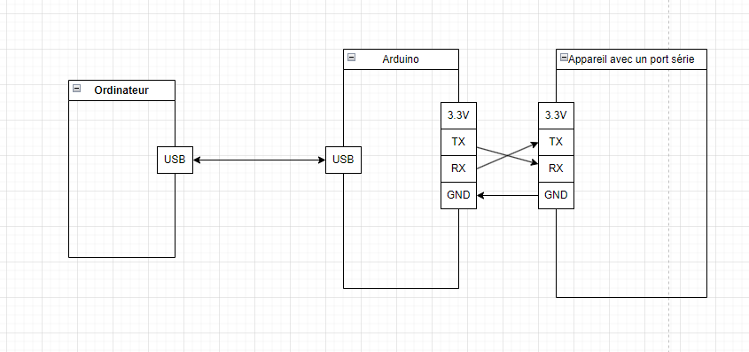

## Contexte

J'avais besoin d'un adaptateur serie-USB pour faire du reverse de firmware sur un appareil chinois bas de gamme, plutot qu'acheter un adaptateur usb TTL suspicieux sur internet, j'ai découvert que l'on pouvais le faire avec un arduino UNO R3.

## Passer l'arduino en convertisseur USB TTL

Pour faire cette manipulation, il faut brancher brancher le pin RESET de l'arduino sur un port GND. Le micro controlleur de l'arduino sera ensuite bypass et les données TTL reçues sur le port RX seront envoyées à l'ordinateur.

## Connexion à un appareil

Le principe de la connexion:
Notre appareil sera connecté via 3 broches (la broche 3.3V ne sert pas car notre appareil sera démarrer lors de la lecture sur le port série)

On branche le pin gnd sur la prise gnd et le TX sur le RX ainsi que le RX sur le TX.

## Sur l'ordinateur

Sous windows, il faut utiliser YAT, attention: il faut faire attention aux caractères de retour à la ligne ainsi que bitrate

Sous linux, on peux lire le port serie avec picocom
