## Introduction
Il y a quelques années, avant ChatGPT et la démocratisation des plateformes d'apprentissage à la cybersécurité, 2 mois avant l'arrivée du covid, période durant laquelle je jouais de la guitare depuis environ 1 an en autodidacte. Pour mon apprentissage je me suis à la recherche d'un outil pour afficher et apprendre des accords et des gammes. Au final je n'ai jamais utilisé cet outil mais il m'a appris autre chose: Comment fonctionne l'activation d'un logiciel. Dans les mêmes moments où j'ai trouvé ce logiciel, j'apprenais la sécurité logicielle informatique et le fonctionnement des logiciels, celui où rien n'est vrai, tout est mensonge pour l'utilisateur (et tout n'est pas permis, loin de là!). Cette petite expérience est l'une des raisons de ce blog, j'ai toujours souhaité publier un article sur cette expérience alors la voilà!

## Le logiciel

Le logiciel s'appelle Guitar Chords Crash Courses ou G3C, le site était déja en abandonware en 2020, en 2025 il n'est plus du tout disponible sauf sur archive.org, activer le logiciel ne dérangera personne car il n'est plus vendu, de plus son activation est vraiment optionnelle. Nous sommes également ici pour le coté éducatif!  
Voici le lien archive.org du site: [http://www.bincsoft.com/?page=download](https://web.archive.org/web/20060616051104/http://www.bincsoft.com/?page=download)  
2 versions sont disponibles : la version 3.4 qui est la dernière version officielle et la version 4.0 bêta. J'avais choisi d'utiliser la version 3.4 car elle est plus simple.  
A noté également que ce logiciel était distributé dans des magasines et est trouvable sur certains cd rom dans des versions plus anciennes, voici un lien pour voir ces versions: [lien](https://discmaster.textfiles.com/search?q=G3C).

## L'activation du logiciel

Au démarrage du logiciel, nous arrivons sur la fenêtre principale du logiciel, en allant dans le menu "about" cette fenêtre s'affiche:  
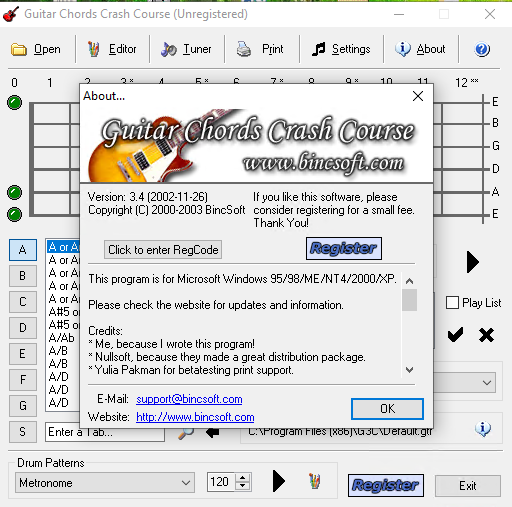

Lors du clic sur le bouton Registrar nous sommes redirigés sur une page web, ce qui va nous intéresser est le bouton Click to enter RegCode:  
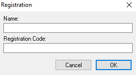

Lorsque l'on commence à taper un code, nous avons ce message:  
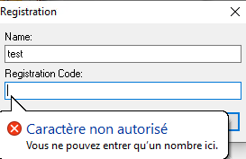

Ici c'est simplement de la curiosité, on sait que le code d'activation ne sera composé que de nombres, le nombre de possibilités est donc limité.  
J'ajoute ces informations de souvenir, l'activation ne se fait pas avec un serveur en ligne, je n'ai donc pas à m'occuper. Est-ce qu'il faut une connexion internet pour l'activation? Existe-t-il un moyen d'activation hors ligne? Ici tout est fait sur l'ordinateur qui exécute le logiciel, ce qui est logique vu la période d'écriture du logiciel (2003) logiquement l'activation se fait sur l'ordinateur, la clé ne dépend pas d'un élément externe et ca facilite énormément la création de clé ainsi que la simplicité de création d'un activateur.  
On pourrait utiliser une méthode de brute force pour trouver la clé en faisant des tentatives mais ca serait beaucoup trop long! Surtout sans informations sur la longueur de la clé. C'est pour ca qu'entre en jeu la partie intéressante: l'ingénierie inverse du logiciel.


## La préparation du reverse engineering du logiciel

On va explorer tranquillement le fichier .exe de l'outil, pour commencer on prend l'outil Detect It easy (ou DIE, [lien](https://github.com/horsicq/Detect-It-Easy)) pour voir comment est constitué le fichier.  
Après l'analyse on voit ceci:  
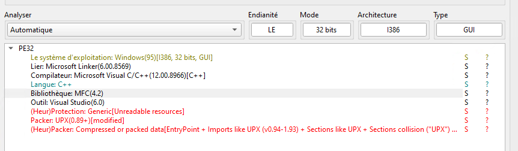
Cette première analyse nous donne des informations intéressantes:
- Le logiciel est compilé pour les processeurs i386 (en réalité: x86), les processeurs de presque tous les ordinateurs sous windows jusqu'à 2025, 
- Il est compilé en mode 32 bits, cela permet d'obtenir un code machine assembleur beaucoup plus clair et lisible que le mode assembleur 64 bits!  

Pour le moment c'est tout ce qui est intéressant, on peut maintenant préparer les choses sérieuses: La décompilation et l'analyse du logiciel, pour cela je vais utiliser les logiciels cutter (cutter.re), x32/x64dbg, IDA et ollyDbg. Ce sont tous des debugger et se complètent bien entre eux.

## Le reverse ... ou presque!

Alors... comment fait-on pour comprendre le fonctionnement d'un logiciel? Eh bien on le lance dans un désassembleur et on regarde! En lancant le logiciel dans cutter on peut commencer à voir des choses. Mais surtout, on va pouvoir lancer le logiciel et l'arrêter où on veut!

On importe donc notre fichier G3C.exe dans Cutter pour voir les chaines et on arrive sur ceci:
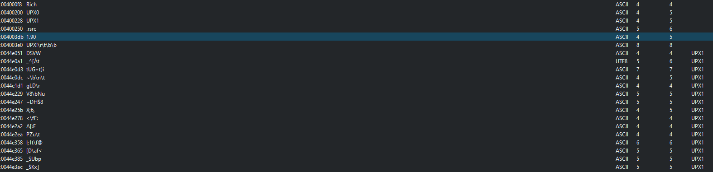

> Ici il s'agit de quelque chose que soit j'avais oublié, soit la version obtenue à l'époque n'avait pas cette protection ou les outils de l'époque (qui sont les mêmes) automatisais le retrait de cette sécurité. Au moment du reverse j'avais du utiliser le debugger dynamique pour contourner cette sécurité sans le savoir.

Comme on peut le voir sur cette image (et sur le screen précédent du logiciel DIE juste avant), le fichier est compressé en "pack" au format UPX. Je ne me souvenais plus de cette partie, c'est en voulant refaire l'analyse que je l'ai remarqué!  
Passons maintenant à la suite, comment retirer la protection et avoir le fichier sans la compression UPX? Eh bien tout simplement avec l'outil qui permet de compresser au format UPX qui s'appelle... UPX et [disponible sur github](https://github.com/upx/upx).  
Ensuite on unpack le fichier avec la commande:
```sh
./upx.exe -d G3C.exe -o G3C-unpack.exe
```

Ensuite, en ouvrant le nouveau fichier dans cutter, on obtient les informations suivantes:
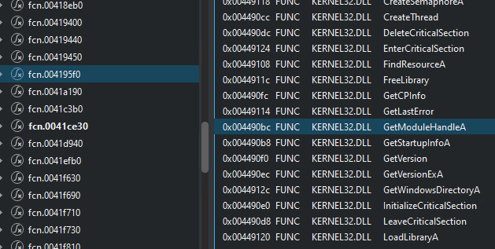

Cette fois-ci, on obtient ce que nous souhaitons: le contenu du fichier en clair et en statique! (Le logiciel n'est pas démarré).

## Le reverse... pour de vrai cette fois

Maintenant que nous pouvons vraiment analyser notre fichier, ici on va chercher la fonction (le bout de code) qui permet la vérification de la clé par le logiciel.  
On commence donc à regarder les chaines disponibles et comment est organisé le fichier dans cutter. Ici j'utilise mes souvenirs, je me rappelle avoir trouvé cette table plus ou moins par hasard pendant mes recherches:
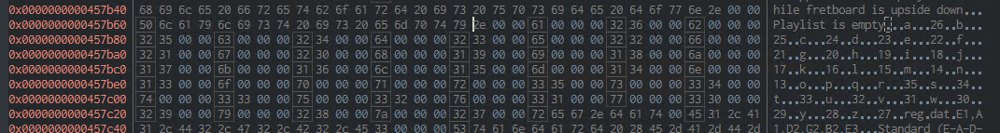

Dans la partie gauche de la capture, on peut voir les lettres de l'alphabet associées à des numéros, on remarque également un nom de fichier "reg.dat" qui pourrait être intéressant pour la suite.

On continue nos recherches parmi les fonctions, on cherche des fonctions de manipulation de chaines de caractères ainsi que d'ouverture et lecture de fichiers.  
On peut trouver ceci:
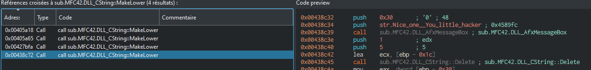

Un hacker... c'est ce que nous sommes non? 😎  
On continue notre promenade autour de cette fonction et nous arrivons sur cette chaine: 
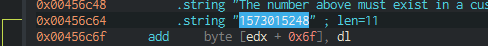

Le code assembleur associé est celui-ci:
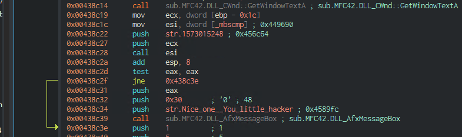
Une petite explication pour le code car la lisibilité peut être compliquée:
- Le code commence par récupérer la chaine "1573015248" qui est un numéro d'enregistrement "magique": le logiciel indiquera que nous sommes un hacker si nous avons ce numéro, mais il est surement possible d'activer le logiciel avec le nom associé à ce numéro (on en reparlera plus tard). 
- Ensuite on compare "1573015248" à ce qui a été saisi comme clé
- Si c'est ce qui a été saisi, on affiche la boite de dialogue indiquant que nous sommes un hacker.

On relance donc avec cutter le logiciel, on arrive sur la fenêtre, on saisit n'importe quel nom, on met **1573015248** en numéro d'enregistrement et nous tombons sur...  
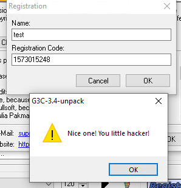

On peut également vérifier où est appelée la chaine indiquant que le numéro d'enregistrement est faux, voici le code d'appel:  
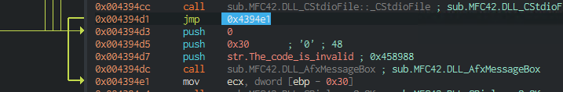

Explication du code:
- La commande ``jmp 0x4394e1`` est la condition qui permet de ne pas afficher le message indiquant que le numéro est faux. 
- La flèche à gauche de la ligne ``push 0`` est celle qui nous intéresse car elle charge le message d'échec d'activation  

On regarde donc d'où vient le code:
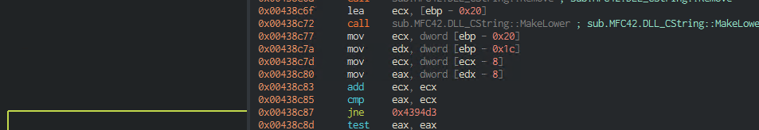

A partir d'ici, on pourrait simplement remplacer l'instruction de la ligne ``jne 0x4394d3`` et la remplacer par l'instruction ``nop`` (0x90 en hexa), cette modification servirait à supprimer la condition de vérification du numéro de série. 
Même si un patch est possible, il vaut mieux continuer et être capable de générer nos propres numéros de série valides sans avoir à modifier le fichier .exe!

Faisons un petit récap:
- Nous avons localisé où se trouve le test de la chaine qui permet d'afficher que nous sommes un hacker
- Nous avons l'emplacement du code qui affiche ce message
- Nous pouvons faire un patch pour supprimer la vérification du numéro d'enregistrement
- Logiquement, la vérification de la chaine se trouve dans les alentours de cette vérification


## La vérification du numéro d'enregistrement

Nous allons donc maintenant nous placer dans les alentours de l'appel au message et commencer à voir ce qu'il se passe. Stratégiquement par souvenir je vais placer un breakpoint et arrêter mon programme lorsqu'il arrivera juste après la condition qui vérifie si le numéro est différent de 1573015248.
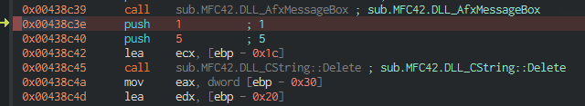


On relance notre programme et on exécute pas à pas, en saisissant la valeur "12345678" en numéro d'enregistrement au passage à l'instruction à l'adresse 0x00438c45, le numéro en position numéro 5 est retiré (on commence à la position 0 donc le "6" est retiré pour mon exemple).
Voici la vue avec OllyDbg (il affiche directement les valeurs des chaines de caractères):
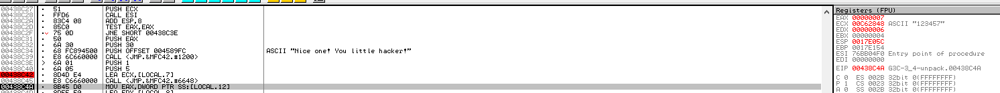

En supplément du retrait du caractère, il y a également un appel à une fonction pour mettre le nom intégralement en minuscule.
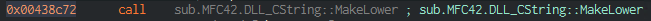

Ensuite toujours avec le nom test et différentes chaines, il faut passer l'instruction ``jne``:   
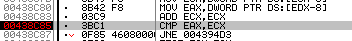

Après plusieurs tests, il s'agit en réalité de la longueur du nom qui est comparée au numéro d'enregistrement: avec la valeur en position 5 (je rappelle qu'on part de 0 donc le 6ième caractère saisi), la longueur du numéro d'enregistrement doit être 2 fois celle du nom saisi + 1 (le 6ième caractère qui sera retiré).  

Pour la partie suivante, je passe rapidement car c'est long et compliqué à expliquer: Chaque lettre du nom est associée à la table de caractères évoquée dans la première partie du reverse.
> Par exemple: 'a' devient 26, 'b' devient 25, 'z' devient 27, 'r' devient 35, 'q' devient 10

Pour la suite, ma clé serait donc: 332230433 (le 0 correspond au caractère retiré par le programme)

En saisissant ces informations, on trouve cette valeur:  
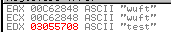

Ici on veut que les 2 premières lignes correspondent au terme de la dernière ligne "test". Je n'ai pas vraiment envie d'en faire une analyse approfondie car la solution est assez simple à voir: le numéro qui correspond à chaque lettre est incrémenté de sa position dans le nom (en partant de 0 pour le premier caractère).   
Par exemple pour le nom test:
- test correspond à la valeur: 33 22 34 33
- en incrémentant chaque position on trouve la chaine: 33 23 36 36
- Avec un 0 en plus, on trouve: 332330636

On refait un test:  
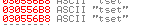

Magie! On trouve le nom à l'envers, la chaine serait donc inversée? Utilisons cutter pour probablement la dernière fois:  
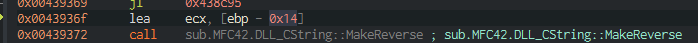

Il y a bien un reverse! Notre numéro d'enregistrement doit être inversé, donc on reprend notre chaine de base qui est "test" avec les valeurs: ``33 22 34 33``,ensuite on l'inverse ``33 34 22 33``, on incrémente chaque position ``33 35 24 36`` et on ajoute un numéro au hasard: ``333529436``

Sauf que... ca ne fonctionne pas. Je ne vais pas chercher beaucoup plus loin car que je le savais déja: la longueur du nom doit être d'au moins 6 caractères. Ainsi le nom ``testab`` fonctionne avec le numéro d'enregistrement ``2527395372638``.

Sans en être sûr à 100%, la limitation d'au moins 6 caractères semble venir de ces 2 lignes:  
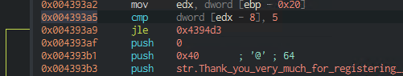

Ici l'instruction ``cmp dword [edx-8],5`` semble comparer la longueur du nom avec la valeur 5. L'instruction ``jle 0x494d3`` renvoie vers une erreur d'activation, jle correspond à jump less equal, si le résultat de l'instruction cmp est inférieur ou égal à 5, l'instruction jump est exécutée, sinon on passe à l'instruction suivante ``push 0`` (cas où le nom fait au moins 6 caractères).


## La création d'un logiciel pour générer une clé

Maintenant que nous savons créer une clé valide, on peux se créer un petit outil pour la générer automatiquement non?

Voici l'algorithme qui permet de générer une clé:
```
Saisie d'un nom de minimum 6 lettres minuscules (sinon le logiciel passe tout en minuscule)
Inverse le nom saisi
Chaque lettre se voit transformée en un nombre et ce nombre se voit ajouter sa position (démarre à 0 pour le premier caractère)
Insert un chiffre entre les chiffres n° 5 et 6 
```

Voici le code Go, converti depuis un vieux code C++ que j'avais fait, ce code n'est pas optimisé mais suffit largement pour générer des clés:
```go
package main

import (
	"bufio"
	"fmt"
	"os"
	"strings"
)

// letterToNumber convertit une lettre en nombre selon la table définie
func letterToNumber(letter rune) int {
	switch letter {
	case 'a':
		return 26
	case 'b':
		return 25
	case 'c':
		return 24
	case 'd':
		return 23
	case 'e':
		return 22
	case 'f':
		return 21
	case 'g':
		return 20
	case 'h':
		return 19
	case 'i':
		return 18
	case 'j':
		return 17
	case 'k':
		return 16
	case 'l':
		return 15
	case 'm':
		return 14
	case 'n':
		return 13
	case 'o':
		return 12
	case 'p':
		return 11
	case 'q':
		return 10
	case 'r':
		return 35
	case 's':
		return 34
	case 't':
		return 33
	case 'u':
		return 32
	case 'v':
		return 31
	case 'w':
		return 30
	case 'x':
		return 29
	case 'y':
		return 28
	case 'z':
		return 27
	default:
		return 0
	}
}

// buildRegistrationCode génère le code d’enregistrement
func buildRegistrationCode(name string) string {
	// inverser la chaîne
	runes := []rune(name)
	for i, j := 0, len(runes)-1; i < j; i, j = i+1, j-1 {
		runes[i], runes[j] = runes[j], runes[i]
	}

	registrationCode := ""
	for i, r := range runes {
		registrationCode += fmt.Sprintf("%d", letterToNumber(r)+i)
	}

	// insère le "9" en position 6 (index 5)
	if len(registrationCode) >= 5 {
		registrationCode = registrationCode[:5] + "9" + registrationCode[5:]
	}
	return registrationCode
}

func main() {
	reader := bufio.NewReader(os.Stdin)
	var inputName string

	for {
		fmt.Println("Saisissez le nom d'utilisateur pour la licence, ce nom doit être au moins composé de 6 lettres (les chiffres ne sont pas acceptés)")
		fmt.Print("Input name: ")

		text, _ := reader.ReadString('\n')
		inputName = strings.TrimSpace(text)

		if len(inputName) >= 6 {
			break
		}
	}

	// mise en minuscule
	inputName = strings.ToLower(inputName)
	fmt.Println("Name:", inputName)
	fmt.Println("Registration Code:", buildRegistrationCode(inputName))
}
```

## Le mot de la fin

Après plus de 5 ans à y réfléchir cet article est enfin rédigé! Je n'ai pas beaucoup l'occasion de faire ce genre d'exercice mais c'est très plaisant de retoucher à ca. Merci à la personne qui m'a motivé à le faire!  
