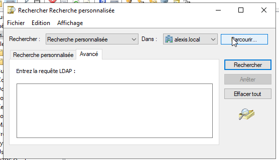

J'ai découvert les filtres LDAP il y a peu suite à un besoin d'améliorer la synchronisation entre un serveur ADDS et un serveur GLPI.

## Tester un filtre LDAP sur ADDS

Pour tester un filte LDAP sur ADDS, il faut aller dans la console de gestion des utilisateurs de l'ad puis clique droit sur le domaine et Rechercher..., choisir ensuite Recherche personnalisée puis le mode Avancé.




## Organisation d'un filtre LDAP

Un filtre LDAP s'articule autour de conditions, les parenthèses sont importantes et très utilisées.

Voici la forme d'un filtre LDAP:
```sh
(<attribut>=<valeur>)
```

Nous pouvons utiliser différents opérateurs:
```
& : ET logique entre les conditions
| : OU logique entre les conditions
! : NON logique (inverse la condition)

```

Opérateurs de test:
```
>= : supérieur ou égale
<= : inférieur ou égal
~= : approximativement égal à
= : égale à
* : n'importe quel élément/caractère
```

Association de condition:
```sh
([&|!](<condition 1>)(condition 2))
```

## Chemin LDAP

Un chemin LDAP permet de chercher des objects dans l'AD, le chemin LDAP doit terminer par: ``DC=<nom domaine>,DC=<tld>``


Un chemin LDAP est de la forme:

```sh
CN=<nom groupe ou user>,OU=<nom OU>,DC=<nom domaine>,DC=<tld>
```


## Exemples de filtre

- Obtenir tous les éléments de l'annuaire:
```sh
objectClass=*
```

- Obtenir tous éléments de class utilisateur (ordinateur ET utilisateurs):
```sh
objectClass=user
```

- Obtenir tous les utilisateurs:
```sh
(&(objectClass=user)(objectCategory=person))
```

- Obtenir tous les ordinateurs:
```sh
((&(objectClass=user)(objectCategory=computer)))
```

> Pour l'AD, les ordinateurs sont des utilisateurs

- Obtenir un groupe:
```sh
(objectCategory=group)
```

- Obtenir les membres d'un groupe:
```sh
(&(objectCategory=person)(objectClass=user)(memberof=CN=<nom du groupe>, ... ,DC=<nom domaine>,DC=<tld>))
```

- Obtenir les ordinateurs d'un groupe:
```sh
(&(objectCategory=person)(objectClass=computer)(memberof=CN=<nom du groupe>, ... ,DC=<nom domaine>,DC=<tld>))
```

- Obtenir les comptes non désactivés:
```sh
(&(objectCategory=person)(objectClass=user)(!(userAccountControl:1.2.840.113556.1.4.803:=2)))
```

- Obtenir les utilisateurs des groupes appartenant à un groupe:
```sh
(&(objectCategory=person)(objectClass=user)(memberOf:1.2.840.113556.1.4.1941:=CN=<Nom du groupe>,...,DC=<domaine>,DC=<tld>))
```

- Tous les utilisateurs qui n'ont pas de department:
```sh
(&(&(objectClass=user)(objectCategory=person))(!(department=*)))

```

## Liens

- Doc de google: [https://support.google.com/a/answer/6126589?hl=fr#zippy=%2Crequ%C3%AAtes-ldap-de-base%2Crequ%C3%AAtes-ldap-sp%C3%A9cifiques](https://support.google.com/a/answer/6126589?hl=fr#zippy=%2Crequ%C3%AAtes-ldap-de-base%2Crequ%C3%AAtes-ldap-sp%C3%A9cifiques)

- RFC2254: [https://www.ietf.org/rfc/rfc2254.txt?number=2254](https://www.ietf.org/rfc/rfc2254.txt?number=2254)

- Documentation de Microsoft: [https://learn.microsoft.com/fr-fr/windows/win32/adsi/search-filter-syntax?redirectedfrom=MSDN](https://learn.microsoft.com/fr-fr/windows/win32/adsi/search-filter-syntax?redirectedfrom=MSDN)

- Une doc sur la base des chemins LDAP: [https://web.archive.org/web/20240207120150/https://jean-luc-massat.pedaweb.univ-amu.fr/ens/jee/ldap.html](https://web.archive.org/web/20240207120150/https://jean-luc-massat.pedaweb.univ-amu.fr/ens/jee/ldap.html)

- Problème sur les groupes imbriqués: [https://confluence.atlassian.com/crowdkb/active-directory-user-filter-does-not-search-nested-groups-715130424.html](https://confluence.atlassian.com/crowdkb/active-directory-user-filter-does-not-search-nested-groups-715130424.html)

- Cours sur openLDAP: [https://mparienti.developpez.com/cours/openldap/](https://mparienti.developpez.com/cours/openldap/)

## Notes:

Je n'ai pas traité les filtres avec des OU mais il s'agit d'éléments comme les filtres avec les &