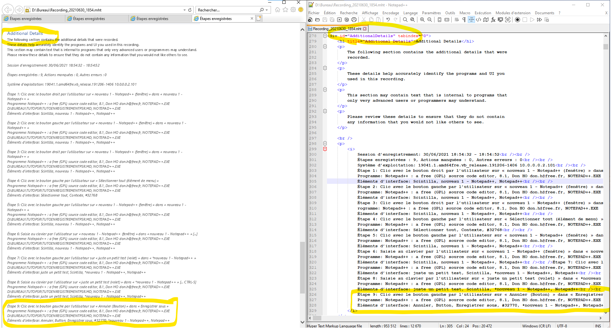
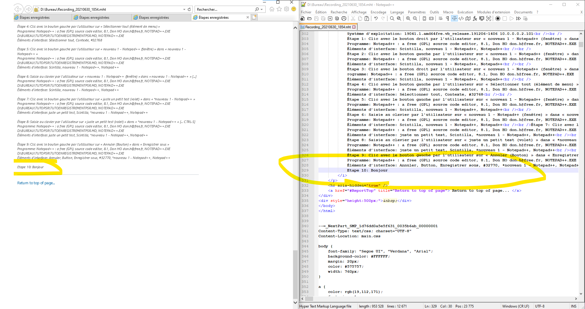

Un tutoriel rapide crée il y a un moment sur les fichiers obtenu avec l'enregistreur d'actions utilisateur de windows. L'outil 
La sortie de l'outil est un fichier zip qui contient un fichier .mht. Le format mht est un format très proche du HTML mais il contient les images encodées en base64 plutot que de les enregistrer à coté.

Voici un éditeur de mth en ligne mais il ne semble pas possible de récuperer les images: [lien](https://products.aspose.app/words/editor/mht)

## 1 - Extraire le fichier

Le fichier sauvegardé est un zip donc il suffit de le dézipper avec windows ou 7zip ou winrar ou autre.... (clique droit -> décompresser)
On obtiens un fichier .mht de notre enregistrement, ce fichier ne semble être lisible que via internet explorer ou edge.

## 2 - Le fichier

On obtiens un fichier qui contient TOUT ce qui est enregistré, les textes et les images.
Pour modifier le fichier, on a besoin de 2 choses:
- un navigateur internet pour voir le fichier (edge ou internet explorer)
- un editeur de texte, le bloc note peux suffir, mais [notepad ++](https://notepad-plus-plus.org/) ou visual studio code sont quand même plus intéressant, en plus ils colorent la syntaxe html donc ca rend le code plus lisible.


## 3 - Supprimer des parties du document

Ici c'est simple, on ouvre d'un coté le navigateur web, de l'autre l'éditeur de texte, ensuite on supprime la partie que l'on souhaite.
Exemple pour Supprimer les "Additional Details" a la fin du document:



Ici, on à la partie Additional Detail sur mon navigateur web à gauche. A droite on à quasiment la même chose mais avec plus de détails.
Maintenant, si je veux supprimer l'étape 9 surligner en bas du navigateur web et de mon éditeur, je vais, dans mon éditeur de texte supprimer les 3 lignes de l'étape 9, ensuite en enregistrant le fichier et en faisant F5 sur mon navigateur web, la ligne etape 9 de Additional details à disparu. On peux faire pareil pour en supprimer plusieurs.

Et pour supprimer toute la partie additional details? 

Il faut supprimer toute la balise ```<div id="AdditionalDetails" tabindex="0"> ```.
Pour faire simple, il faut supprimer les lignes de: ``` <div id="AdditionalDetails" tabindex="0"> ``` jusqu'a la prochaine balise ```</div>``` (ici il n'y a pas d'autres balises div dans la balise div, mais attention pour d'autres sections du document)

## 4 - Modifier le texte
Plus simple cette fois, il suffit juste d'ajouter le texte à l'endroit que l'on veux, en faisant attention aux balises. 

Exemple: j'ai ajouté une étape 10:


PS: on peux probablement utiliser les balise html pour modifier le texte(html4 probablement, internet explorer ne doit pas supporter a 100% le html5).  
Par exemple:  
- ```<br>``` = saut de ligne  
- ```<i> Texte à mettre en italique </i>``` = texte en italique
- ```<b> Texte à mettre en gras </b>``` = texte en gras
- ``` <a>``` pour ajouter des liens (ce n'est pas la balise entière, juste son "nom")
- ```  ``` pour ajouter des images (externes au document, pour les ajouter directement au fichier mht, il faut les convertir en base64 puis les ajouter au document )


## 5 - Extraire les images
Pour les images:  
    - Elles sont sauvegardées à la fin du fichier  
    - Elles sont encodées en base64  
  => Elles sont facilements convertissables


- 1 : La structure des images:  
        - Ligne 1: --=_NextPart  
              - Cette ligne indique le début d'un "bloc" qui contient les infos d'une image  
        - Ligne 2: Content-type  
              - Indique image/jpeg, le type du contenu de la chaine de la base64 et sont format  
        - Ligne 3: Content-transfer-Encoding:  
              - L'encodage de l'image, pour nous c'est la base64  
        - Ligne 4: Content-Location:  
              - Le nom de fichier donné à l'image.  
        - Ensuite on a tout un bloc de caractère qui ne veulent rien dire, il faut faire un copier coller de tout le bloc de caractère (ATTENTION: toutes les images sont les unes à la suite des autres donc il faut s'arreter avant le saut de ligne puis à la ligne --=_NextPart)  

- 2 : Une fois toute la chaine de caractère en base 64 de l'image récupérée, il suffit de coller cette chaine dans un convertisseur base64 -> jpg comme celui ci: [lien vers le convertisseur](https://base64.guru/converter/decode/image/jpg)

## 6 - Modifier le style du document:

Il faut chercher la partie:
```
--=_NextPart_SMP_1d76dd0a5e5f631_0035b6ab_00000001
Content-Type: text/css; charset="UTF-8"
Content-Location: main.css
```
Cette partie se trouve en début de fichier.  

Jusqu'au prochain --=_NextPart_SMP_ on peux ajouter/supprimer/modifier des choses. Il faut modifer la partie qui intéresse en réperant les balises du texte que l'on veux modifier. C'est un peu complexe, le mieux est d'aller voir des cours HTML/CSS basiques.

