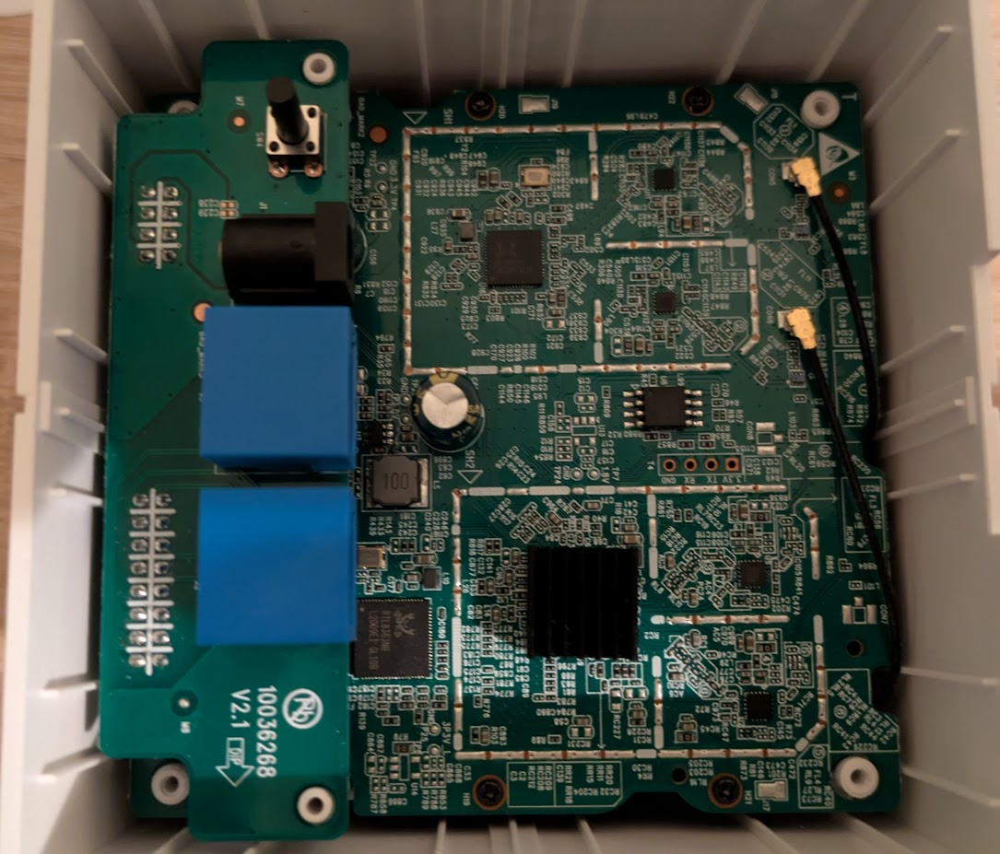
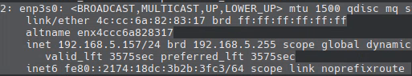
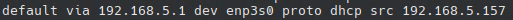
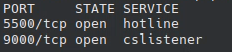

> Cet article n'est pas terminé, il ne s'agit que du début, la suite arrivera plus tard

Ca fait un moment que je souhaitais m'initier sérieusement au reverse d'un appareil chinois, l'objectif est de comprendre ses fonctionnements, vérifier ce qui est remonté aux serveur et aller le plus loin possible pour ce qu'on peux faire avec.

## La cible

La cible sera une borne Wifi Tenda MW6, le lien officiel du fabricant est disponible ici: https://web.archive.org/web/20220707094929/https://www.tendacn.com/fr/product/specification/mw6.html

Pluseurs versions de cette borne Wifi existe:
- La première version de 2018 avec ses spec ici: https://web.archive.org/web/20250301134914/https://techinfodepot.shoutwiki.com/wiki/Tenda_Mesh3_(Nova_MW6)  
- Il semble y avoir eu de nouvelles versions jusqu'en 2023 d'après le site de la FCC

Pour voir les versions sur le site de la FCC: https://apps.fcc.gov/oetcf/eas/reports/GenericSearch.cfm
Grantee Code: V7T  
Product Code: MESH3 (MESH3V3 dans mon cas)  

On voit sur les différentes versions qu'il y a eu des évolutions, les premières versions sont plus travaillées, les parties qui gèrent le wifi sont protégées par des shield qui ont disparu avec les nouvelles versions. Le modèle exact du processeur a également été modifié en passant du Realtek 8197F au Realtek 8197H.

Ce genre d'appareil est générique: le même appareil est souvent vendu sous plusieurs marque/modèles différent mais la partie électronique est la même.


## Le matériel

Ce répéteur wifi est basé sur une carte Realtek basée sur le rtl8197, il s'agit d'une carte de base que Realtek revend pour les constructeurs d'appareil, souvent il n'y a aucune modification ou très peu.
Voici une photo de l'electronique de l'appareil:


Plusieurs zones peuvent être identifiées:
- Une première est la carte fille qui contient 2 ports RJ45, un bouton ainsi que le connecteur d'alimentation. Sur la carte mère en dessous est situé le circuit qui gère l'alimentation de la carte.
- Nous avons ensuite 2 zones qui sont entourées d'étain non utilisé, il s'agit d'emplacements pour mettre des shield pour protéger des interferences, ici Tenda à fait le choix de ne pas en mêttre, sur les anciennes version des shields étais présents. En évitant les interferences, le débit wifi est amélioré car il n'y a pas de perturbation du signal, le fait qu'il n'y ai pas de shield empeche probablement d'atteindre la performance maximale du wifi de l'appareil.
    - La zone la plus haute sur ma photo est celle à laquelle sont reliées les antennes wifi, le chipset qui controle le wifi est un rtl8812FR
    - La seconde zone avec le gros carré noir est celle qui contient le chipset Realtek rtl8197F, sur la carte, il y a également 2 emplacements d'antennes non soudés qui sont disponibles pour utilisé le wifi avec ce chipset.
- A gauche de la zone qui contient le chipset principal se trouve un petit chipset rtl8363NB, il gère les ports rj45 de l'appareil
- Entre les 2 zones qui devraient avoir un shield se trouve 2 éléments qui vont être très importants:
    - La puce mémoire qui contient le programme du logiciel, souvent il s'agit d'un code de base plus ou moins modifié par le constructeur
    - Un port UART (les 4 trous sous la puce mémoire) qui permet une connexion série avec un ordinateur, ici il est disponible prêt à être utilisé et le circuit imprimée indique ce qui correspond à chaque pastille. Sur des appareils de marques réputées, ce type de port est caché et vérouillé, sur les appareils chinois, il sont souvent laissé en place (c'est de moins en moins le cas) ce qui permet de modifier les firmwares plus simplement.

Concernant la partie wifi, les bornes vendues en pack ont des numéros de série consécutifs et chaque pack utilise le même SSID et mot de passe. A noter que le nom du wifi pour les appareils est "NOVA_<4 derniers chiffres de l'adresse mac>".
Celui du Wifi Mesh (lien des bornes entre elles en wifi) est NOVA_VIP et le mot de passe... 12345678

## La récupération d'information depuis l'extérieur

Pour commencer les recherches sur l'accès, on commence par se renseigner un peu sur internet, [ce depot github](https://github.com/latonita/tenda-reverse) regroupe un bon début de piste.

Nous pouvons également lancer un nmap sur les différentes interfaces de l'appareil:
- Je commence par le port rj45 "LAN":



L'ip par défaut de l'appareil est 192.168.5.1, à partir de cette information nous pouvons apprenons qu'il y a un dhcp sur l'appareil et que par défaut l'ip LAN (wifi ou port rj45 LAN) est 192.168.5.1.  
Pour aller plus loin, voici un nmap des ports ouverts sur la prise rj45 LAN:


Il y a 2 ports ouverts: Le port 5500 et le port 9000, actuellemetn je ne sais pas à quoi servent ces ports, peux être pour la communication avec l'application.

- On regarde ensuite le wifi, il devrais y avoir la même chose que pour le port rj45 LAN:


A ma grande surprise: les même ports sont ouverts.

- Il reste le port rj45 "WAN" qui devrait être relié à une box pour l'accès internet. Ici ca ne sera pas le cas, la connexion sera mon ordinateur:  


Cette fois c'est plus critique, nous sommes sur l'interface qui a accès au monde extérieur et les ports sont étranges:
 - Le port 113 correspond à un vieux protocole de connexion: il est normal qu'il soit fermé, tout va bien
 - Le port 53 est le port du protocole DNS, ce n'est pas le mieux à placer sur un port WAN, il serait plus logique qu'il soit sur le réseau interne (port LAN et wifi)
 - Les ports 80 et 443... ce sont les ports qui sevrent pour la connexion via navigateur (http et https), le fait que le port wan ouvre ces ports est plus critique: sur le port LAN nous pourrions accéder à la configuration de l'appareil DANS le sous réseau 192.168.5.1, le nombre d'appareil y serait limité, ici il s'agit du réseau externe, par exemple sur l'appareil serait directement sur la connexion internet, TOUS LE MONDE pourrais accéder à l'interface de gestion de l'appareil ce qui n'est **pas du tout** sécurisé mais je ne suis pas surpris de trouver cette faille.
 Après vérification avec netcat, aucun serveur http n'est configuré sur ces ports, peux être qu'il s'agit des ports qui servent pour la configuration depuis l'application mobile et auraient besoin de paquets spécifique?


## L'entrée dans la borne wifi

Maintenant l'objectif va être d'accéder au contenu de la mémoire du retour.  
On commence par le port UART, pour cette manipulation je vais utiliser un flipper zero mais un arduino peux également suffir, sinon il faut un adaptateur TTL-USB disponible pour quelques euros sur Amazon. Sur Windows le terminal YAT fait l'affaire, pour Linux picocom est très bien.  

Les informations viennent [du même depot github qu'indiqué plus haut](https://github.com/latonita/tenda-reverse), je n'ai pas la même version de la carte mais il s'agit du même appareil donc la plupart des informations sont exactes.  

Pour effectuer la connexion sur le port UART, je vais utiliser picocom sur linux à un débit de 115200 et au démarrage de l'appareil, pour une utilisation sur Windows, il faut que le caractère de fin de ligne soit \n (LF) pour l'envoi de message, pour la reception il semble s'agit de CR LF. Il faut également un outil qui supporte la couleur des messages pour éviter une sortie polluée par des caractères spéciaux.


### Le début du boot

```sh
Booting...
init_ram
DDR init OK
init ddr ok
DRAM Type: DDR2
	DRAM frequency: 533MHz
	DRAM Size: 128MB
JEDEC id 684017, EXT id 0x6840
found BH25Q64
flash vendor: HuaHong
BH25Q64, size=8MB, erasesize=4KB, max_speed_hz=55MHz
auto_mode=0 addr_width=3 erase_opcode=0x00000020
Write PLL1=80c00042
=>CPU Wake-up interrupt happen! GISR=89000080 
RTL8197F-VG boot release version:708 (Dec 28 2020-22:24:53) (999MHz)
```

Avant le message Booting, il semble y avoir des caractères spéciaux envoyés sur le port série, je ne sais pas à quoi ils servent et je ne pense pas en avoir besoin pour le moment.  
Nous apprenons et confirmons beaucoup d'informations avec ces quelques lignes:
- La ram est de 128MB en DDR2 à une fréquence de 533MHz 
- La puce mémoire est une HuaHong BH25Q64 de 8MB et organisée en blocks de 4KB, c'est vraiment peu mais suffisant pour le code d'une borne wifi. La marque de la puce est une marque générique chinoise, surement pour faire des économie.
- La référence exacte du SOC realtek est RTL8197-VG, il s'agit d'un SOC MIPS qui a été mis à jour en 2020  

A la suite un message s'affiche:
```sh
wait for upgrage
```
Il y a une faute qui n'a jamais été corrigée par Realtek: upgrage au lieu de upgrade, cette faute montre l'interet porté pour ce genre de Board: une carte pas cher qui permet de faire des appareils à bon prix mais qui ne sont pas correctement suivi (pas de mise à jour), c'est le problème de la plupart des appareils de marques chinoises, peu cher mais bourré de failles et de problème, ce type d'appareil reçoit 1 ou 2 petites mises à jour dans sa durée de vie, seulement pour corriger un problème vraiment critique si il y en a un.


### Le démarrage du système

Au démarrage du système, la borne est toujours aussi bavarde...

```sh
start address: 0x8049f6a0
Linux version 3.10.90 (root@localhost.localdomain) (gcc version 4.4.7 (Realtek MSDK-4.4.7 Build 2001) ) #1 Mon Dec 27 13:04:04 CST 2021
```
Le firmware a été compilé sur le SDK Realtek 4.4.7 avec un kernel linux 3.10 (en 2020 ce kernel était totalement dépassé), une grosse faille de ssécurité est présente et confirme le danger potentiel de ces produits: ils ne sont pas mis à jour et contienne de base d'anciennes versions complètements dépassées des logiciels.  

Le paramétrage du port UART:
```sh
Kernel command line: console=ttyS0,115200 root=/dev/mtdblock4
```
Cette ligne indique qu'il est possible de se connecter en Série sur l'appareil, nous serons redirigé sur la partition /dev/mtdblock4 lors de la connexion en tant que root.  

Une ligne **Très** importante:
```sh
m25p80 spi0.0: found BH25Q64, expected m25p80
```
Cette ligne indique que le firmware s'attend à utiliser une puce m25p80 (mémoire flash NOR de 8MB de chez STMicroelectronics) or nous avons une BOHONG BG25Q64, il s'agit surement d'une copie de la même puce mais l'organisation des pins ainsi que le fonctionnement de la mémoire est peux être différent. 

Ensuite, une liste très importante s'affiche:
```sh
Creating 7 MTD partitions on "m25p80":
0x000000000000-0x000000800000 : "ALL"
0x000000000000-0x000000020000 : "Bootloader"
0x000000020000-0x000000030000 : "CFG"
0x000000030000-0x0000007e0000 : "KernelFS"
0x000000244012-0x0000007e0000 : "RootFS"
0x0000007e0000-0x0000007f0000 : "CFM"
0x0000007f0000-0x000000800000 : "CFM_BACKUP"
```
Il s'agit de **toutes** les zones mémoires qui composent le firmware, il devrait être possible de faire un dump du firmware... en passant par le port série, nous y reviendrons.

Pour la suite, il s'agit de l'extraction du firmware dans la ram: le contenu de la mémoire NOR est lu et décompressé dans la RAM, ce qui fait que les changements apportés ne sont pas persistants. Pour les rendre persistant, il faut passer par la commande CFM qui correspond à la partition CFM qui est la seule montée en écriture.

La prochaine ligne indique un changement de mot de passe pour le compte root, ca ne sera pas celui mis par défaut:
```sh
prod_change_root_passwd(90)
```

Un process wserver se lance, il semble s'agit d'un serveur tcp:
```sh
argv[0] = wserver
wserver
```

Il semble y avoir iptable d'installé:
```sh
iptables v1.4.4: Couldn't find target `access_ctrl'
Try8`iptables -h' or 'iptables --help' for more information.
```

Le démarrage du serveur DNS:
```sh
[arainc][ip 192.168.5.1][dns www.tendawifi.com]lan_start(169)
[arainc][out is {"Domain":"www.tendawifi.com","Ix":"192.168.5.1"}]lan_start(174)
[arainc][ip 192.168.5.1][dns tendawifi.com]lan_start(169)
[arainc][out is {"Domain":"tendawifi.com","Ip":"192.168.5.1"}]lan_start(174)
```

Le démarrage du wifi mesh:
```sh
mesh_passphrase_update, before encrypt
77078 77 38 37 37 76 38 6b 70 36 36 67 XX XX XX 
mesh_passphrase_update, after encrypt
0b 7d 49 5d 13 66ed 49 e10d90ba 2f 78 XX XX XX 
```
La passphrase doit être inscrite en dur quelque part dans le firmware et chiffrée puis modifiée au démarrage de la borne, le fait d'envoyer cette information sur le port série casse tous l'interet du chiffrement...


Encore une chose amusante: la version du firmware n'a pas été incrémentée par les développeurs et se retrouve dans le fimware de prod:
```sh
Warning: The source codes has been modified but the version number has not been incremented.

There are two ways to increment the version number:
If there are few changes, you can run `make cbb/wifi/tendawifi/steerd_only` to build, and the patch version will be automatically incremented.
Or you can run `make -C cbb/wifi/tendawifi/steerd set_version version="<MAJOR>.<MINOR>.<PATCH> [COMMENT]"` to specify the new version.

After you increment the version number, the file `cbb/wifi/tendawifi/steerd/version.txt` will be updated, you can submit the changes to the server when needed. E.g:
    git add cbb/wifi/tendawifi/steerd cbb/wifi/tendawifi/kernel/td_multiap_steer
    git commit -m "update version for steerd."
    git push origin HEAD:refs/for/dev_ugw6.0_main

If you are using local compiled `steerd`, this warning may appear again until you recompile it.
To rebuild the release package for RTL, you can run:
    make cbb/wifi/tendawifi/steerd_only
    make release
To rebuild the release package for QCA, you can run:
    make cbb/wifi/tendawifi/steerd_only
    tar -C cbb/wifi -c -j -f cbb/wifi/<VENDOR>_wifi_release.bz2 <VENDOR>_wifi_release

3.0.61 (Auto increment from http://172.16.30.83:18088/svn/11S_MESH/SourceCodes/Trunk/MW6V3.0/develop/cbb/wifi/tendawifi/steerd  53)
```

### Après le démarrage

Après le démarrage un message est renvoyé régulièrement sur le port série, il contient... le ssid des réseaux wifi ainsi que leurs mots de passe... en clair:
```sh
wlan_get_master_cfg(151) SSID[NOVA_XXXX]
wlan_get_master_cfg(160) wifi_pwd[XXXXXX]
wlan_get_master_cfg(151) SSID[NOVA_VIP]
wlan_get_master_cfg(160) wifi_pwd[12345678]
```
Une fois de plus, il n'y a aucune sécurité.

D'autres messages reviennents en boucle:
```sh
ERROR:ugw_proc_send_msg[313]connect server is fail.
func:log_encode_msg_to_server, line:64, send msg is fail.
```
L'erreur viens peux être du fait que la borne n'est pas connectée au web et ne peux pas contacter sa "maison" (i.e. un serveur chinois)


La borne connait également les bornes associées à son pack et cherche à les contacter (ma borne correspond au sn X-1):
```sh
ptr->serial_num=E8593010207L00AAAX is offline
ptr->serial_num=E8593010207L00AAAY is offline
```

Lorsqu'un message est envoyé via le port série depuis un appareil externe, ce message s'affiche:
```sh
Normal startupGive root password for system maintenance
(or type Control-D for normal startup):
Normal startup
```
Pour résumer: depuis la console série, si on envoie un caractère de retour à la ligne puis le mot de passe suivi d'un caractère de retour à la ligne nous pouvons accéder à la console série en tant que root et modifier des paramètres du logiciel.

Dernière chose pour cette (longue) partie: le démarrage de telnet. lors de l'appui sur le bouton "reset" de l'appareil, ces lignes apparaissent sur le port série:
```sh
[rest_button_pressed_handle][180][luminais] gpio_ctrl : reset button pressed : 1
[rest_button_pressed_handle][180][luminais] gpio_ctrl : reset button pressed : 2
[rest_button_pressed_handle][180][luminais] gpio_ctrl : reset button pressed : 3
```

et au bout de 3s:
```sh
tim [netctrl_recv_hanle][1052] i recv msg 72?op=1
tim [netctrl_recv_hanle][1055] i recv id 72
tim [netctrl_recv_hanle][1060] role get SUCESS
tim [netctrl_recv_hanle][1068] handle id 72 ,role 3 3
djc__telnet_cmd is telnetd -b 192.168.5.1____telnet_start(46)
argv[0] = telnetd
argv[1] = -b
argv[2] = 192.168.5.1
telnetd
```
telnet est démarré!

Le mot de passe est le même que celui à utilisé pour la connexion root sur le port série.

Comme indiqué avant, l'obtention du mot de passe est indiqué [sur ce dépot github](https://github.com/latonita/tenda-reverse). Pour obtenir le mot de passe, il faut calculer la base64 de la clé de sécurité du wifi:
```sh
base64(<mdp ssid NOVA_XXXX>)
```
Ce qui donne en commande linux:
```sh
echo -n "<mdp wifi>" | base64
```

### Le démarrage sur le bootloader de la borne wifi

Ici il s'agit d'un bootloader Realtek, sur d'autres processeur il s'agit généralement de U-Boot. La manière de démarrer sur le bootloader varie suivant les appareils, sur certains il faut envoyer le caractère d'une touche de clavier sur le port série au démarrage (touche echap ou entrée), pour le Tenda MW6 il faut **brancher l'appareil puis rapidement appuyer et maintenir le bouton reset enfoncé au démarrage de la borne**.

Lors du démarrage, la console série va bloquer sur le message:
```sh
=>CPU Wake-up interrupt happen! GISR=89000080 
RTL8197F-VG boot release version:708 (Dec 28 2020-22:24:53) (999MHz)
```
Au bout de quelques secondes, la borne démarre en mode bootloader et affiche le message:
```sh
Entry disaster mode
```

Ensuite nous avons la main sur le shell du bootloader:
```sh
<RealTek>
```

Voici la liste des commandes du bootloader:
```sh
<RealTek>?

----------------- COMMAND MODE HELP ------------------

HELP (?)				    : Print this help message
DB <Address> <Len>
DW <Address> <Len>
EB <Address> <Value1> <Value2>...
EW <Address> <Value1> <Value2>...
CMP: CMP <dst><src><length>
IPCONFIG:<TargetAddress>
MEMCPY:<dst><src><length>
AUTOBURN: 0/1
LOADADDR: <Load Address>
J: Jump to <TargetAddress>
reboot
FLI: Flash init
FLR: FLR <dst><src><length>
FLW <dst_ROM_offset><src_RAM_addr><length_Byte> <SPI cnt#>: Write to SPI
MDIOR:  MDIOR  <reg>
MDIOW:  MDIOW <PHYID> <reg> <data>
PHYR: PHYR <PHYID><reg>
PHYW: PHYW <PHYID><reg><data>
PHYPR: PHYPR <PHYID><page><reg>
PHYPW: PHYPW <PHYID><page><reg><data>
COUNTER: Dump Asic Counter
XMOD <addr>  [jump] 
TI : timer init 
T : T <len> <loop>
ETH : startup Ethernet
CPUClk: 
CP0
ERASECHIP
ERASESECTOR
SPICLB (<flash ID>) : SPI Flash Calibration
SFLTEST : SFLTEST <offset> <length> <count>   - spi nor flash test
D8 <Address>
E8 <Address> <Value>
```

A partir de maintenant, l'appareil est sous controle, il est possible de:
- Démarrer sur le bootloader et extraire le firmware et le contenu de la mémoire
- Avoir un accès root et modifier les paramètres
- Flasher un autre firmware sans avoir à déssouder la puce mémoire, malheureusement openWRT n'est pas compatible avec cet appareil à cause du driver Realtek qui n'est pas disponible en opensource, je ne pense pas aller jusqu'à créer une image openWRT pour cet appareil.

La prochaine étape va être le dump du firmware sans déssouder la puce.

## Dump du firmware


## Liens qui m'ont été utiles

- [https://github.com/latonita/tenda-reverse](https://github.com/latonita/tenda-reverse)
- [https://www.youtube.com/watch?v=ZmZuKA-Rst0](https://www.youtube.com/watch?v=ZmZuKA-Rst0)
- [Un portage d'openwrt pour le chipset 8197](https://github.com/choryuidentify/openwrt-rtl8197f/tree/master)
- [Un second portage d'openwrt](https://github.com/Alexey-Tsarev/openwrt-rtl819x)
- [Les SDK pour les soc Realtek](https://sourceforge.net/projects/rtl819x/files/)
- [Encore un SDK](https://github.com/aborgda/rtl819x_3411d_mg1200ac/tree/master)
- [Un autre SDK](https://github.com/AskeyDB40/RTL8197_3411D_2/tree/masters)
- [Le code du Bootloader du Realtek 8197](https://github.com/7felix7/bootcode_rtl8197f/tree/master)
- [Un autre portage openWRT](https://github.com/7felix7/openwrt_rtk8197f)
- [Extraction de firmware sans soudure](https://www.cyberark.com/resources/threat-research-blog/accessing-and-dumping-firmware-through-uart)
- [Extraire un firmware avec un flipper zero](https://www.youtube.com/watch?v=8LRelmB55QE)
- [Analyser un firmware](https://www.youtube.com/watch?v=GIU4yJn2-2A)
- [L'analyse d'un appareil Tenda](https://armx.exploitlab.net/docs/emulating-tenda-ac15.html#section-1---obtaining-the-firmware)
- [Un guide pour Binwalk](https://fr3ak-hacks.medium.com/analysing-and-extracting-firmware-using-binwalk-982012281ff6)
- [Documentation sur le bootloader](https://oldwiki.archive.openwrt.org/doc/techref/bootloader/realtek)
- [Envoi de firmware via TFTP](https://wiki.8devices.com/komikan:uboot)
- [Hack du silvercrest smart home de Lidl](https://paulbanks.org/projects/lidl-zigbee/#overview)
- [Bootloader realtek](https://gist.github.com/vitali2y/79ca747be49f146971b5a7fa89a0a637?permalink_comment_id=3323240)
- [Script pour faire dump le firmware d'un SoC rtl8196/rtl8197](https://github.com/banksy-git/lidl-gateway-freedom/tree/master/scripts)
- [Reverse d'un routeur Tenda](https://byebyesky.github.io/blog/hacking/embedded/2019/05/28/hacking-a-router-3.html)